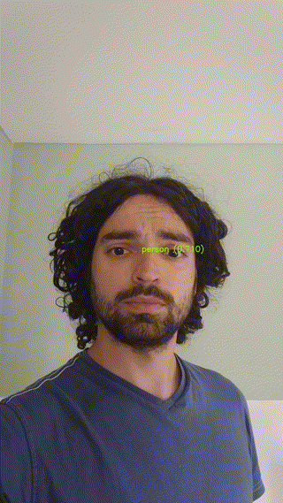

*See the [Workshop Webpage](https://www.primate-cognition.eu/de/veranstaltungen/bridging-the-technological-gap-workshop.html) for the context of this tutorial.* <br>
*See the [Workshop ML part Confluence Page](https://ccp-eva.atlassian.net/wiki/external/231442020/NzM0MTJiYzVlZjk5NDJlZWJiYzY3ZTNhZWQyZDhlOTU?atlOrigin=eyJpIjoiMmJlM2Q0NzY3MTM2NGI0NGIyMmIzYjMxMDc3Y2RhNGMiLCJwIjoiYyJ9) for initial installation steps and further interactive content.*

# Introduction

The gap between what is achieve in the computer vision field, and the computer vision tools used in other fields, exists because of the lack of communication between the two fields. Thanks to this workshop and the proposed hand-on session, we hope to fill this gap in an funny and interactive way.

In this tutorial, we shall solve a simple classification task with one provided dataset, and if you have time, your own dataset! Let's hope you can do the same with a more serious scientific question in your future projects!



# Installation

<!--
For organization:
``` bash
# to create md5sums files
find -type f -exec md5sum "{}" + > MD5SUMS
# to create env .yml files
conda env export --name ME22_env --file environment_with_versions.yml
conda env export --name ME22_env --from-history --file environment.yml
```
-->

Before coming to the workshop, make sure to set your computer or borrow a computer. 64bit computer is requiered. GPU and CUDA is advised but not mandatory.

Then in your terminal, follow the following steps:

``` bash
# Clone baseline repo via command line or manually using the browser: download zip file, extract it in appropriate location and open a terminal in tuto_classification folder
## git function for cloning
git clone https://github.com/ccp-eva/tuto_classification.git
## cd function to go to your directory
cd tuto_classification
```

You should have downloaded the github repo. This repo should contain several python file. In order to all have the same installation environment, we will use conda that you have installed previously.

## Replicate environment with .yml files (preferred)

For all platforms, the provided `.yml` files should help you replicated the environment. Conda shall do the rest to make it work.

``` bash
# Create the conda environment (you can change the name and location)
conda env create -f environment.yml
# Activate the conda environment
conda activate env_workshop
```

### For linux based platform

## From scratch

``` bash
# Create a new environment with python 3.7 for compatibility with the different librairies
conda create -n env_tuto python=3.7
conda activate env_tuto
# Install pytorch
conda install pytorch torchvision torchaudio cpuonly -c pytorch
# Install opencv and matplotlib
conda install -c conda-forge opencv matplotlib
# Install scikit learn
conda install -c anaconda scikit-learn 
```

## For MAC

``` bash
# Create a new environment with python 3.7 for compatibility with the different librairies
conda create -n env_tuto python=3.7
conda activate env_tuto
# Install pytorch
conda install pytorch torchvision torchaudio -c pytorch
# Install opencv and matplotlib
conda install -c conda-forge opencv matplotlib
# Install scikit learn
conda install -c anaconda scikit-learn 
```

## For Windows

``` bash
# Create a new environment with python 3.7 for compatibility with the different librairies
conda create -n env_tuto python=3.7
conda activate env_tuto
# Install pytorch
conda install pytorch torchvision torchaudio cpuonly -c pytorch
# Install opencv and matplotlib
conda install -c conda-forge opencv matplotlib
# Install scikit learn
conda install -c anaconda scikit-learn 
```

# The first steps

The next steps may be done before the workshop and any bug/difficulties may be reported to the organizers.

``` bash
# Extract frames from videos
python 1_create_database.py
# Split your databse
python 2_split_database.py
# Run classification on you database split framewisely
python 3_cnn_classification.py my_dataset_framewise_split
# Run classification on you database split videowisely
python 3_cnn_classification.py my_dataset_framewise_split
```

These steps should create several folders:
- a log folder for script 1 and 2.
- a few images to represent your datasets.
- cnn_classification_output folder for script 3. It should contain a folder for each call of the function. The latest should contain the weights of the model your just trained on the given dataset, and some images representing its performance.

Finally, use one of the output folder of script 3 to run the demo app. It shall use your camera and indicate the infered class of your model.

``` bash
# Run your app
python 4_run_app.py [path_of_you_trained_model_folder] --show-demo
```

You can also run the app with an external video:


``` bash
# Run your app
python 4_run_app.py [path_of_you_trained_model_folder] --video-input video_test.mp4 --show-demo
```

## Commun issues

- Import error with PIL:
``` bash
ImportError: cannot import name 'PILLOW_VERSION' from 'PIL' (/home/pemartin/Documents/MPI/Projects/tuto_classification/env/lib/python3.7/site-packages/PIL/__init__.py)
```
Solve by running:
``` bash
conda install -c anaconda pillow=6.1
```
- images are 90° clockwise rotated: not an error. Internal rotation of the device is not taken into with some librairies.
- Error showing image opencv when running script 4 with camera.
``` bash
cv2.error: OpenCV(3.4.2) /tmp/build/80754af9/opencv-suite_1535558553474/work/modules/highgui/src/window.cpp:632: error: (-2:Unspecified error) The function is not implemented. Rebuild the library with Windows, GTK+ 2.x or Carbon support. If you are on Ubuntu or Debian, install libgtk2.0-dev and pkg-config, then re-run cmake or configure script in function 'cvShowImage'
```
The following solution may lead with no longer be able to process videos. Meaning run script 1 and script 4 with a video. Solution: by running ():
``` bash
conda remove opencv
# If python version > 3.6
conda install python=3.6
conda install -c menpo opencv3
```
The torch version may have been affected. Therefore you will have to re-run script 3 before be able to use script 4.
- CUDA Error. There may come from various reason. Then use cpu in script 3 and 4 by setting the device variable to cpu.
```
python 3_cnn_classification.py my_dataset_framewise_split --device cpu
python 4_run_app.py [path_of_you_trained_model_folder] --device cpu
```

# Further steps

Further steps will be conducted at the workshop. If time allows it, we may create our own dataset and our own task we would like to solve.

Thank you for your participation!

